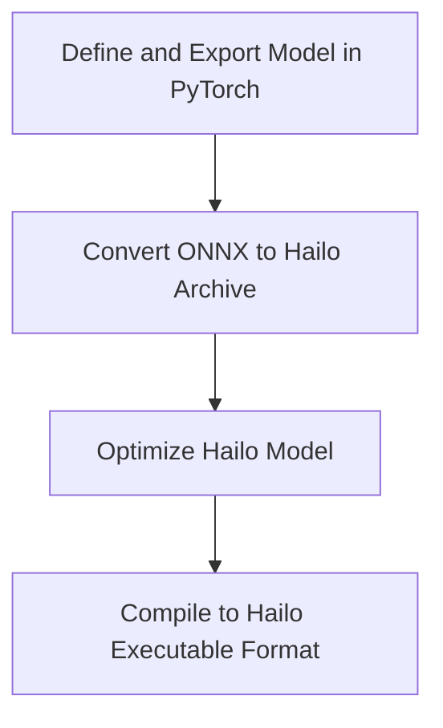

# Hailo Demo



## Pytorch --> ONNX
```sh
cd hailo_demo
python -m venv onnx-conv-env
source onnx-conv-env/bin/activate
pip install -r onnx-conv-env-req.txt
python torch_demo_model.py
```

[torch_demo_model.py](torch_demo_model.py) will output a [model_static.onnx](model_static.onnx) file which can be converted to .har format.

## ONNX --> Hailo Archive (.har)
Create an account in [Hailo Developer Zone](https://hailo.ai/) and download the [Hailo Dataflow Compiler SDK](https://hailo.ai/developer-zone/software-downloads/?product=ai_accelerators&device=hailo_8_8l)

```sh
cd hailo_demo
python3.10 -m venv hailo-demo-env # IMPORTANT: Hailo Data Conversion Flow only supports python3.10
source hailo-demo-env/bin/activate
pip install <downloaded-hailo-sdk-client-whl-file>.whl
python onnx_to_hailo.py
```
[onnx_to_hailo.py](onnx_to_hailo.py) will output a [simple_cnn.har](simple_cnn.har) file which can be optimized and compiled for Hailo hardware.


## Profile .har model
```sh
source hailo-demo-env/bin/activate # Created in above step
hailo profiler simple_cnn.har
```
This will output a [simple_cnn_hailo_model.html](simple_cnn_hailo_model.html) file which can be opened in a web browser to view the profiling results.

## Optimization flow
Still TODO. Not really working right now


