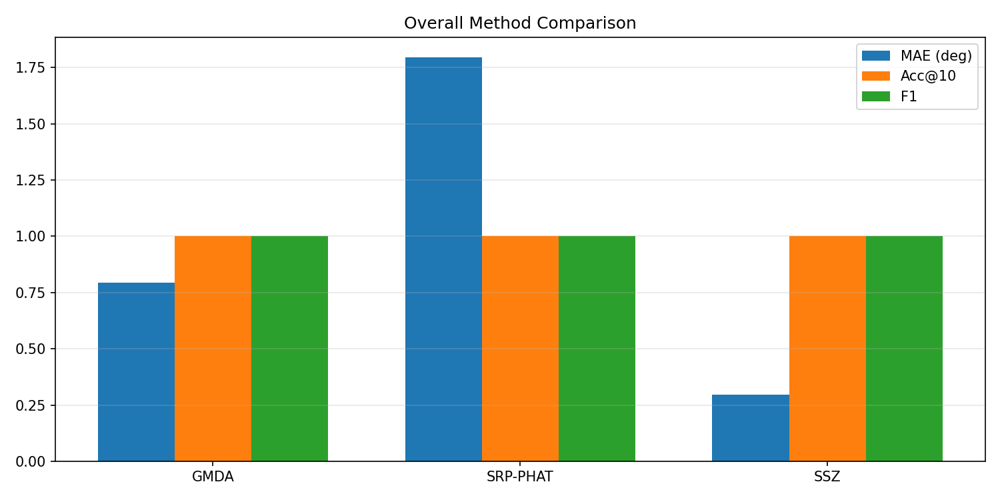
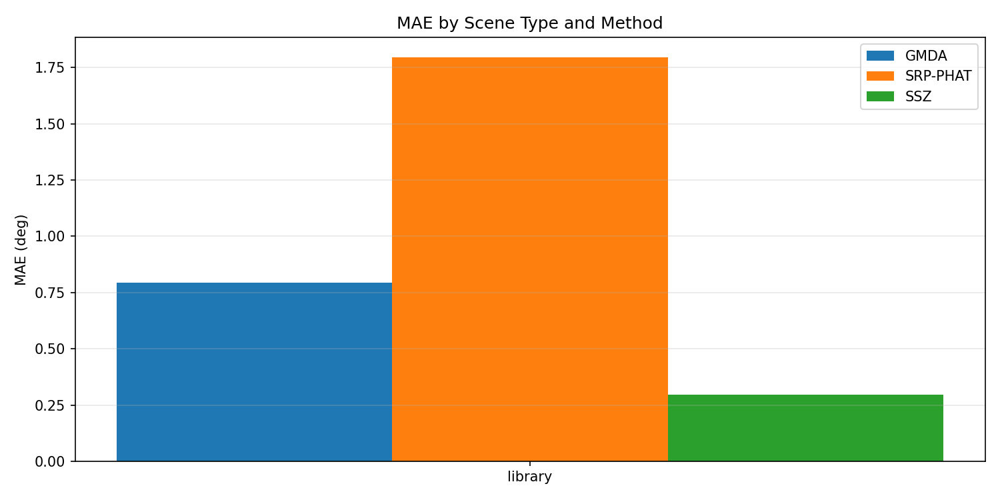
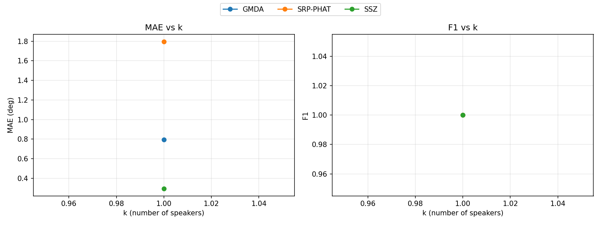

# Localization Benchmark Summary (20260212_000226)

## Overall By Method

| method | n_scenes | MAE(deg) | RMSE(deg) | Acc@10 | Recall | Precision | F1 |
|---|---:|---:|---:|---:|---:|---:|---:|
| GMDA | 1 | 0.795 | 0.795 | 1.000 | 1.000 | 1.000 | 1.000 |
| SRP-PHAT | 1 | 1.795 | 1.795 | 1.000 | 1.000 | 1.000 | 1.000 |
| SSZ | 1 | 0.295 | 0.295 | 1.000 | 1.000 | 1.000 | 1.000 |

## By Scene Type

| method | scene_type | n_scenes | MAE(deg) | Acc@10 | F1 |
|---|---|---:|---:|---:|---:|
| GMDA | library | 1 | 0.795 | 1.000 | 1.000 |
| SRP-PHAT | library | 1 | 1.795 | 1.000 | 1.000 |
| SSZ | library | 1 | 0.295 | 1.000 | 1.000 |

## By Number of Speakers (k)

| method | k | n_scenes | MAE(deg) | Acc@10 | F1 |
|---|---:|---:|---:|---:|---:|
| GMDA | 1 | 1 | 0.795 | 1.000 | 1.000 |
| SRP-PHAT | 1 | 1 | 1.795 | 1.000 | 1.000 |
| SSZ | 1 | 1 | 0.295 | 1.000 | 1.000 |

Generated by `python -m localization.benchmark.run ...`.
