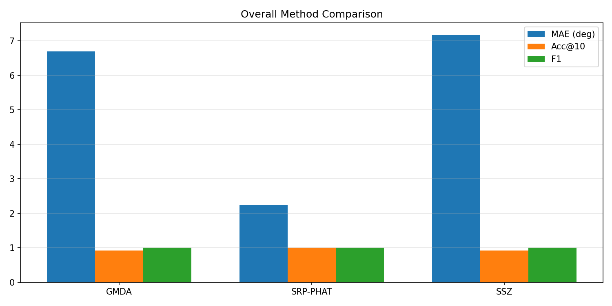
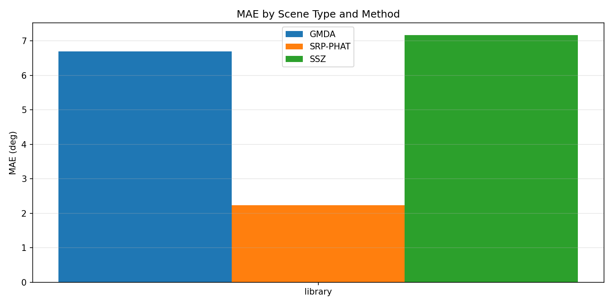
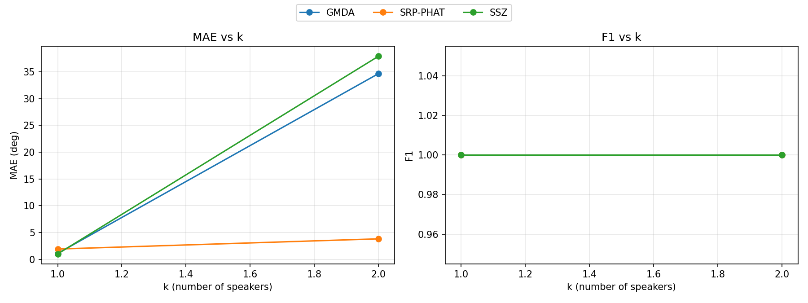

# Localization Benchmark Summary (20260212_040021)

## Overall By Method

| method | n_scenes | MAE(deg) | RMSE(deg) | Acc@10 | Recall | Precision | F1 |
|---|---:|---:|---:|---:|---:|---:|---:|
| GMDA | 6 | 6.693 | 9.076 | 0.917 | 1.000 | 1.000 | 1.000 |
| SRP-PHAT | 6 | 2.235 | 2.276 | 1.000 | 1.000 | 1.000 | 1.000 |
| SSZ | 6 | 7.162 | 9.769 | 0.917 | 1.000 | 1.000 | 1.000 |

## By Scene Type

| method | scene_type | n_scenes | MAE(deg) | Acc@10 | F1 |
|---|---|---:|---:|---:|---:|
| GMDA | library | 6 | 6.693 | 0.917 | 1.000 |
| SRP-PHAT | library | 6 | 2.235 | 1.000 | 1.000 |
| SSZ | library | 6 | 7.162 | 0.917 | 1.000 |

## By Number of Speakers (k)

| method | k | n_scenes | MAE(deg) | Acc@10 | F1 |
|---|---:|---:|---:|---:|---:|
| GMDA | 1 | 5 | 1.103 | 1.000 | 1.000 |
| GMDA | 2 | 1 | 34.644 | 0.500 | 1.000 |
| SRP-PHAT | 1 | 5 | 1.918 | 1.000 | 1.000 |
| SRP-PHAT | 2 | 1 | 3.822 | 1.000 | 1.000 |
| SSZ | 1 | 5 | 1.015 | 1.000 | 1.000 |
| SSZ | 2 | 1 | 37.894 | 0.500 | 1.000 |

Generated by `python -m localization.benchmark.run ...`.
