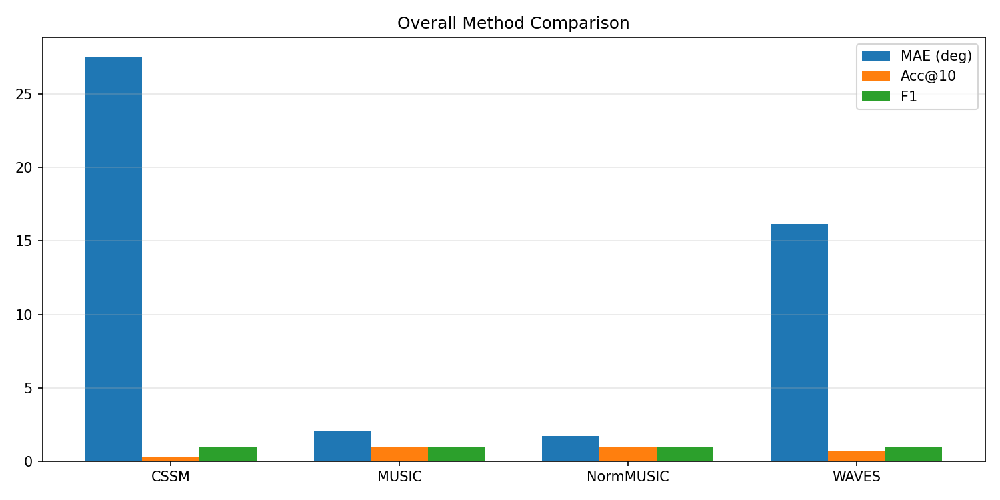
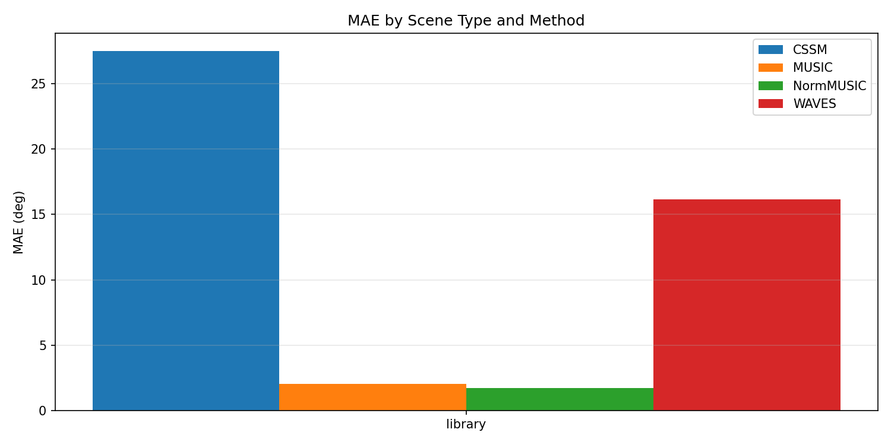
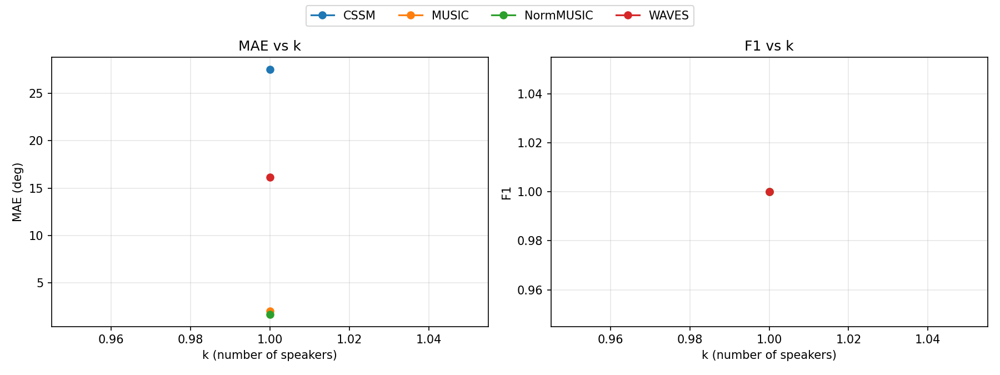

# Localization Benchmark Summary (20260212_041542)

## Overall By Method

| method | n_scenes | MAE(deg) | RMSE(deg) | Acc@10 | Recall | Precision | F1 |
|---|---:|---:|---:|---:|---:|---:|---:|
| CSSM | 3 | 27.487 | 27.487 | 0.333 | 1.000 | 1.000 | 1.000 |
| MUSIC | 3 | 2.047 | 2.047 | 1.000 | 1.000 | 1.000 | 1.000 |
| NormMUSIC | 3 | 1.714 | 1.714 | 1.000 | 1.000 | 1.000 | 1.000 |
| WAVES | 3 | 16.154 | 16.154 | 0.667 | 1.000 | 1.000 | 1.000 |

## By Scene Type

| method | scene_type | n_scenes | MAE(deg) | Acc@10 | F1 |
|---|---|---:|---:|---:|---:|
| CSSM | library | 3 | 27.487 | 0.333 | 1.000 |
| MUSIC | library | 3 | 2.047 | 1.000 | 1.000 |
| NormMUSIC | library | 3 | 1.714 | 1.000 | 1.000 |
| WAVES | library | 3 | 16.154 | 0.667 | 1.000 |

## By Number of Speakers (k)

| method | k | n_scenes | MAE(deg) | Acc@10 | F1 |
|---|---:|---:|---:|---:|---:|
| CSSM | 1 | 3 | 27.487 | 0.333 | 1.000 |
| MUSIC | 1 | 3 | 2.047 | 1.000 | 1.000 |
| NormMUSIC | 1 | 3 | 1.714 | 1.000 | 1.000 |
| WAVES | 1 | 3 | 16.154 | 0.667 | 1.000 |

Generated by `python -m localization.benchmark.run ...`.
