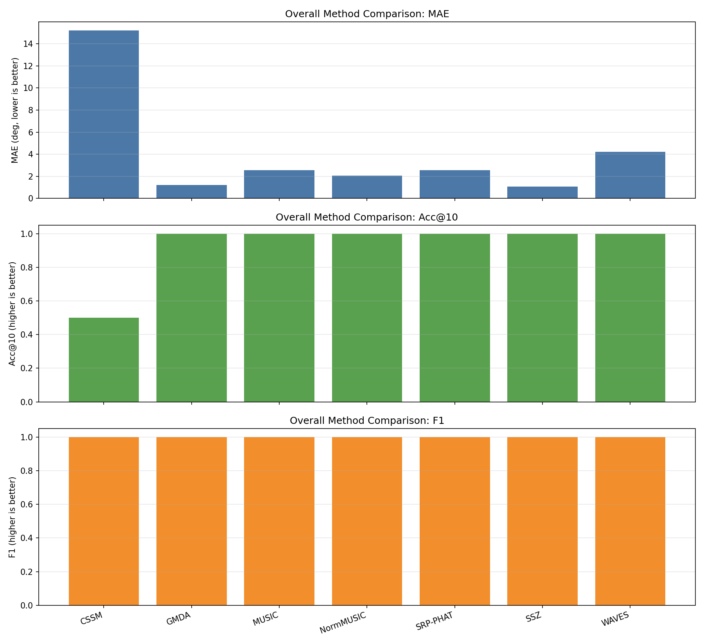
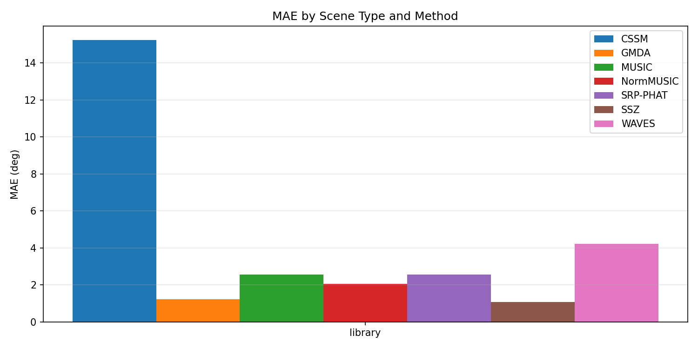
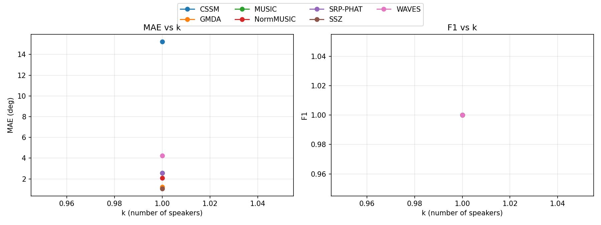

# Localization Benchmark Summary (20260212_042119)

## Overall By Method

| method | n_scenes | MAE(deg) | RMSE(deg) | Acc@10 | Recall | Precision | F1 |
|---|---:|---:|---:|---:|---:|---:|---:|
| CSSM | 2 | 15.227 | 15.227 | 0.500 | 1.000 | 1.000 | 1.000 |
| GMDA | 2 | 1.227 | 1.227 | 1.000 | 1.000 | 1.000 | 1.000 |
| MUSIC | 2 | 2.568 | 2.568 | 1.000 | 1.000 | 1.000 | 1.000 |
| NormMUSIC | 2 | 2.068 | 2.068 | 1.000 | 1.000 | 1.000 | 1.000 |
| SRP-PHAT | 2 | 2.568 | 2.568 | 1.000 | 1.000 | 1.000 | 1.000 |
| SSZ | 2 | 1.068 | 1.068 | 1.000 | 1.000 | 1.000 | 1.000 |
| WAVES | 2 | 4.227 | 4.227 | 1.000 | 1.000 | 1.000 | 1.000 |

## By Scene Type

| method | scene_type | n_scenes | MAE(deg) | Acc@10 | F1 |
|---|---|---:|---:|---:|---:|
| CSSM | library | 2 | 15.227 | 0.500 | 1.000 |
| GMDA | library | 2 | 1.227 | 1.000 | 1.000 |
| MUSIC | library | 2 | 2.568 | 1.000 | 1.000 |
| NormMUSIC | library | 2 | 2.068 | 1.000 | 1.000 |
| SRP-PHAT | library | 2 | 2.568 | 1.000 | 1.000 |
| SSZ | library | 2 | 1.068 | 1.000 | 1.000 |
| WAVES | library | 2 | 4.227 | 1.000 | 1.000 |

## By Number of Speakers (k)

| method | k | n_scenes | MAE(deg) | Acc@10 | F1 |
|---|---:|---:|---:|---:|---:|
| CSSM | 1 | 2 | 15.227 | 0.500 | 1.000 |
| GMDA | 1 | 2 | 1.227 | 1.000 | 1.000 |
| MUSIC | 1 | 2 | 2.568 | 1.000 | 1.000 |
| NormMUSIC | 1 | 2 | 2.068 | 1.000 | 1.000 |
| SRP-PHAT | 1 | 2 | 2.568 | 1.000 | 1.000 |
| SSZ | 1 | 2 | 1.068 | 1.000 | 1.000 |
| WAVES | 1 | 2 | 4.227 | 1.000 | 1.000 |

Generated by `python -m localization.benchmark.run ...`.
