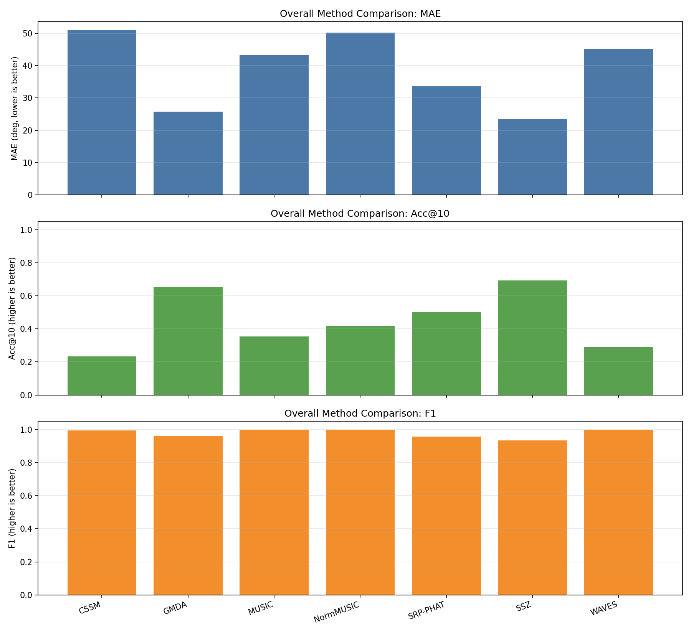
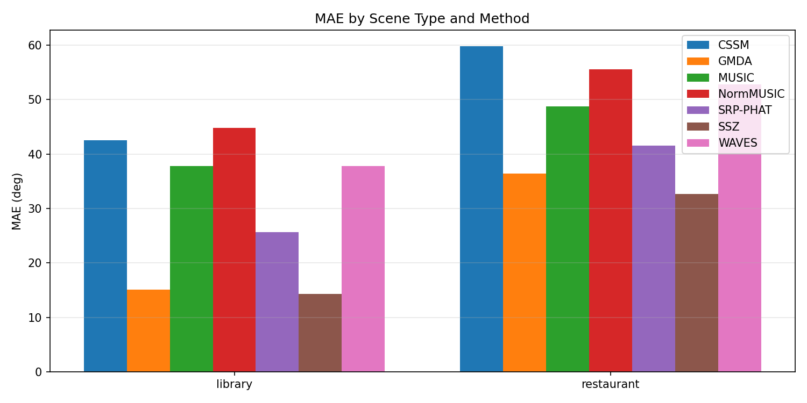

# Localization Benchmark Summary (20260212_154330)

## Overall By Method

| method | n_scenes | MAE(deg) | RMSE(deg) | Acc@10 | Recall | Precision | F1 |
|---|---:|---:|---:|---:|---:|---:|---:|
| CSSM | 400 | 51.095 | 57.880 | 0.233 | 0.573 | 1.000 | 0.995 |
| GMDA | 400 | 25.757 | 33.088 | 0.653 | 0.937 | 1.000 | 0.962 |
| MUSIC | 400 | 43.276 | 52.451 | 0.355 | 1.000 | 1.000 | 1.000 |
| NormMUSIC | 400 | 50.177 | 59.737 | 0.419 | 1.000 | 1.000 | 1.000 |
| SRP-PHAT | 400 | 33.591 | 41.992 | 0.501 | 0.930 | 1.000 | 0.957 |
| SSZ | 400 | 23.471 | 30.402 | 0.692 | 0.906 | 1.000 | 0.935 |
| WAVES | 400 | 45.217 | 52.141 | 0.293 | 0.585 | 1.000 | 1.000 |

## By Scene Type

| method | scene_type | n_scenes | MAE(deg) | Acc@10 | F1 |
|---|---|---:|---:|---:|---:|
| CSSM | library | 200 | 42.497 | 0.325 | 0.998 |
| CSSM | restaurant | 200 | 59.768 | 0.141 | 0.991 |
| GMDA | library | 200 | 15.110 | 0.821 | 0.946 |
| GMDA | restaurant | 200 | 36.404 | 0.485 | 0.978 |
| MUSIC | library | 200 | 37.830 | 0.434 | 1.000 |
| MUSIC | restaurant | 200 | 48.721 | 0.276 | 1.000 |
| NormMUSIC | library | 200 | 44.828 | 0.497 | 1.000 |
| NormMUSIC | restaurant | 200 | 55.526 | 0.341 | 1.000 |
| SRP-PHAT | library | 200 | 25.605 | 0.610 | 0.963 |
| SRP-PHAT | restaurant | 200 | 41.578 | 0.391 | 0.952 |
| SSZ | library | 200 | 14.325 | 0.823 | 0.891 |
| SSZ | restaurant | 200 | 32.617 | 0.561 | 0.979 |
| WAVES | library | 200 | 37.809 | 0.395 | 1.000 |
| WAVES | restaurant | 200 | 52.753 | 0.188 | 1.000 |

## By Number of Speakers (k)

| method | k | n_scenes | MAE(deg) | Acc@10 | F1 |
|---|---:|---:|---:|---:|---:|
| CSSM | 1 | 80 | 47.360 | 0.312 | 1.000 |
| CSSM | 2 | 80 | 56.905 | 0.169 | 0.986 |
| CSSM | 3 | 80 | 49.673 | 0.210 | 0.997 |
| CSSM | 4 | 80 | NA | NA | NA |
| CSSM | 5 | 80 | NA | NA | NA |
| GMDA | 1 | 80 | 36.107 | 0.662 | 1.000 |
| GMDA | 2 | 80 | 23.356 | 0.719 | 1.000 |
| GMDA | 3 | 80 | 30.784 | 0.569 | 0.990 |
| GMDA | 4 | 80 | 21.240 | 0.632 | 0.939 |
| GMDA | 5 | 80 | 17.295 | 0.680 | 0.881 |
| MUSIC | 1 | 80 | 21.051 | 0.762 | 1.000 |
| MUSIC | 2 | 80 | 33.496 | 0.500 | 1.000 |
| MUSIC | 3 | 80 | 52.846 | 0.233 | 1.000 |
| MUSIC | 4 | 80 | 55.179 | 0.122 | 1.000 |
| MUSIC | 5 | 80 | 53.806 | 0.158 | 1.000 |
| NormMUSIC | 1 | 80 | 20.821 | 0.775 | 1.000 |
| NormMUSIC | 2 | 80 | 25.947 | 0.700 | 1.000 |
| NormMUSIC | 3 | 80 | 46.732 | 0.450 | 1.000 |
| NormMUSIC | 4 | 80 | 81.328 | 0.053 | 1.000 |
| NormMUSIC | 5 | 80 | 76.056 | 0.115 | 1.000 |
| SRP-PHAT | 1 | 80 | 37.827 | 0.637 | 1.000 |
| SRP-PHAT | 2 | 80 | 36.453 | 0.494 | 1.000 |
| SRP-PHAT | 3 | 80 | 36.579 | 0.446 | 0.990 |
| SRP-PHAT | 4 | 80 | 31.541 | 0.443 | 0.935 |
| SRP-PHAT | 5 | 80 | 25.556 | 0.483 | 0.861 |
| SSZ | 1 | 80 | 39.456 | 0.600 | 1.000 |
| SSZ | 2 | 80 | 22.439 | 0.762 | 0.971 |
| SSZ | 3 | 80 | 21.890 | 0.708 | 0.940 |
| SSZ | 4 | 80 | 16.362 | 0.704 | 0.893 |
| SSZ | 5 | 80 | 17.209 | 0.687 | 0.871 |
| WAVES | 1 | 80 | 30.026 | 0.487 | 1.000 |
| WAVES | 2 | 80 | 56.391 | 0.169 | 1.000 |
| WAVES | 3 | 80 | 50.071 | 0.212 | 1.000 |
| WAVES | 4 | 80 | NA | NA | NA |
| WAVES | 5 | 80 | NA | NA | NA |

Generated by `python -m localization.benchmark.run ...`.
